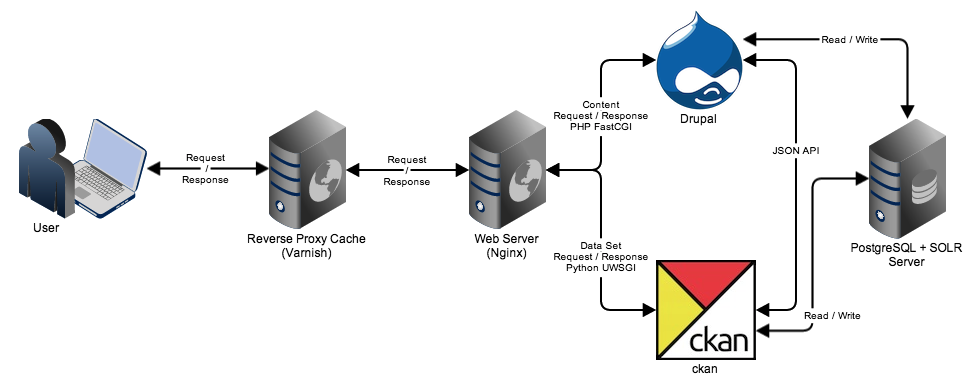

#Proposal: Open data system  

**Submitted by:**  
Arvin Singla  
901-705 King St West.  
Toronto, On, M5V2W8  

*Mon, February 24th, 2014*

**Submitted to:**  
Joan Penumerthy  
Central Agencies I&IT Cluster  
Ministry of Government Services

## Introduction

This proposal will outline a strategy for implementation of an open data resource by leveraging open sources technologies.

Open data initiatives are helping to drive global transparency for government organizations. Access to data empowers people to instigate change, innovate, and become more engaged.

The use of open source technology further subscribes to the philosophies of open data by facilitating sharing of time and resources.

## Assumptions

- This project will be a "ground up" initiative and there is no expectation to build upon any previous implemented solutions.
- Development of this platform will be transparent and any custom code created will be shared and available to the open source community.
- A development team working in an Agile project management methodology should consist of (at minimum) a product owner / Scrum master, three developers with one acting as the technical lead, and a designer with knowledge in UX.

## Proposal

An adoption of two primary tools should be used in combination to build an open data platform. This platform will be supported by an industry standard supporting infrastructure of open source software.

### CKAN - Data management portal

CKAN will serve as the front facing data set management application. Providing data services, APIs, set search, access control, and visualization tools for the project.

The CKAN open source platform is a widely used data management system being used in the Government, NGO, Not-for-profit and commercial space.

Examples of top tier government organizations currently utilizing CKAN as their primary data management portal include the federal government of Canada ([data.gc.ca](data.gc.ca)), the federal government of the United Kingdom ([data.gov.uk](data.gov.uk)) and the federal government of the United States of America ([data.gov](data.gov)).

### Drupal - Content Management System

The Drupal based content management system will serve as the public facing gateway for providing information and social services surrounding the project.

Drupal is one of the largest and most widely used open source content management systems available today. It is being used as a platform to power organizations large and small with one of the largest community ecosystems collaborating on any open source project. 

Many top tier government and NGOs are using Drupal as their primary content management system include the United States Government, The government of Canada, Universities and Not-for-profit organizations. A comprehensive list of global government organizations using Drupal can be found here (https://groups.drupal.org/government-sites).

### Proposed approach (CKAN + Drupal)

Drupal as a platform can be considered a chameleon. It offers an extremely robust system that can be configured to perform many aspects of the functionality offered by CKAN. However at it's core it is a Content Management System, not a Data driven application. 

CKAN as a platform is very feature rich as a data management portal. However it severely lacks in it's ability to provide user engagement in any meaningful way outside of what it was designed for. 

The combination of these two tools together operating in a "side by side" capacity offer an extremely robust solution to providing complex data services while allowing for rich user engagement and social interaction.

The implementation of CKAN completed by the federal government of the United Kingdom (data.gov.uk) leverages Drupal in this side-by-side implementation strategy. Their recommendation of this strategy which I endorse is outlined in this [document](https://docs.google.com/document/d/1rMRxuwVh7rK-dDRZukspC4y2HlXynF4RGS0mj4OjhVo/edit)

Additionally large amounts of effort have been made to ensure that all the code written for data.gov.uk be made available for consumption and re-use by outside organizations. Code repositories on Github are available for all aspects of the project and articles and documentation are also available. While this doesn't provide a turn key solution it does provide excellent building blocks and community resources (code, documentation, and people) that can be drawn upon to ensure major pain points aren't experienced. 

**data.gov.uk resources**

- [data.gov.uk Github repositories](https://github.com/datagovuk)
- [Integrating CKAN and Drupal](http://data.gov.uk/blog/integrating-ckan-and-drupal)
- [Technical implementation details](http://data.gov.uk/about/technical-details)

### Other considered approaches

**Drupal only CMS/DMS**

The initial approach considered for creating a data management portal was to implement only Drupal and have it act as a hybrid CMS/DMS solution. This would simplify some aspects of the infrastructure. It would allow us to achieve approximately 60% of key feature requirements in a short amount of time. However the remainder of the feature requirements would involve a considerable amount of development work.   

**Drupal + CKAN using the DKAN Distribution**

A pre-built [distribution](https://drupal.org/project/dkan) exists within the Drupal community that attempts to integrate Drupal an CKAN. While on the surface this seems like a good starting point there are a number of issues that would need to be addressed. The project is still in the beta stages, unlike the solution implemented and in use currently by data.gov.uk the DKAN distribution is untested in a production environment. It also relies heavily on Drupal to CKAN integration modules which also are not widely in use and would need to be heavily tested and vetted prior to consideration

### Supporting infrastructure

The following is a list of supporting infrastructure software that will be required to ensure the success of the project.

**Linux**

The Linux operating system will act as the foundation upon all the software will run.

**Nginx**

Nginx will act as the web server and reverse proxy responsible for ensuring the routing of user requests to the appropriate application. Nginx was chosen over Apache for it's speed, light use of resources, and scalability.

**Varnish**

Varnish is a reverse proxy cache used to dramatically improve the speed of loading for static content on a website or application. This is accomplished by caching fully loaded versions of the static content on the Varnish server. Requests to the site are made first against varnish which will serve a cached version if it has one and alleviate the need to make a request to the actual web server.

**PostgreSQL**

PostgreSQL is a database platform. It was chosen over MySQL for it's speed and reliability. Additionally both Drupal and CKAN are compatible which allows for the use of a single database server to host both applications.

**Apache SOLR**

SOLR is an enhanced open source enterprise class search platform that can be leveraged by both Drupal and CKAN to provide robust search services. 

### Implementation Diagram

### Feature requirements checklist

 **Manage data sets (upload/update, workflow) and publish in open formats:**

CKAN provides robust user permissions and a publishing workflow for data sets. It supports serving data in a download capacity for almost any format imaginable. In addition known text formats such as CSV can be automatically imported and used for export  via the API browser in a number of formats including XML and JSON. 

 **Ability to browser and search the data sets using search, tags, categorization etc:**

CKAN provides tagging, categorization and text based searching through the use of Apache SOLR. 

 **Tools to contextualize/visualize data using graphs, charts, maps, etc:**

CKAN provides basic data visualization/charting and data browsing capabilities out of the box. Third party extensions and the use of it's built in API functionality allow for any additional requirements such as Maps to be easily integrated.

 **Integration with other back-end systems/external open data tools to pull data for the catalogue:**

CKAN provides an extremely sophisticated harvesting system that allows for data from external systems be easily pulled in on a one off or regular basis to ensure data is kept up to date. Custom or special third party requirements can be met through the development of custom tools using the extendable plugin system.

 **Ability for others to pull/use the open data:**

CKAN allows for the downloading of data in a few ways.

1. Raw data files can be downloaded directly from the system in their original format
1. A data browser for common formats is available for users to view and query data directly in the browser. 
1. Each data set is provided a RESTful api endpoint to allow knowledgable individuals to perform REST calls against a given data set.

 **engagement/interaction functionality for users to comment on data sets, request new data sets, etc.:**

The Drupal CMS portion will allow for comments to be added to data sets, the creation of custom content types for creating and managing requests as well as providing a robust CMS platform to build a feature complete website including following Accessibility standards, Mobile responsive design and Semantic markup. 

 **Ability to create a user profile or log-in using the existing social network account information to use the engagement functions, receive alerts, etc.:**

Drupal can be leveraged as a single sign on component for authentication including the use of third party social networks through oAuth. Integration points can be made with CKAN to allow Drupal to provide many engagement functions like social sharing of resources. Drupal subscribe and notification tools can be leveraged for example to provide update notifications on data sets via email, SMS, and twitter. The Drupal ecosystem is large and the system is extremely flexible in providing any kind of future engagement strategy that may arise.

 **Security and Privacy:**

Drupal and CKAN are two widely used and iterated pieces of open source software being used by many large government organizations. When industry practices are followed both tools have been field tested with a proven track record of ensuring access and information is not compromised.

 **Performance and Scalability:**

As mentioned in the support infrastructure the use of a reverse proxy cache for anonymous users will ensure quick access to the majority of static content on the site. This includes the use of the reverse proxy cache for RESTful API data access. The nature of large open data sets is that they do not change often. This means requests that do not require query parameters can be cached for fast access.

Authenticated users will still benefit from caching at the Drupal level for static page content. The use of Nginx and PostgreSQL will ensure a lower memory footprint and faster data access to ensure that more authenticated requests can be made at a time. Scaling can be achieved by creating a master/slave architecture with more database servers reducing the bottleneck that read/write operations have on perceived page speed.

## Implementation Timeline

Timeline estimations are a difficult task as there are a significant number of factors that can affect how long a project can take to accomplish. The project should be broken into stories organized by Chapters (epics).

Backlog milestones can then be produced to represent a minimum viable product (MVP). This MVP represents a released version of the site which brings significant value but may not be feature complete. It is my estimate that an MVP can be reached within 2-3 months and feature complete in the 4-5 month range.

## Conclusion

If we are to promote the notion of Open Data, we should lead by example and leverage the learning by those who have come before us. While not a standard; CKAN and Drupal represent proven technology that is forward thinking and feature rich. Implementing these solutions doesn't mean stagnation or meeting the norm. It follows higher education practices of building on the work and learning of others to bring forth innovation.